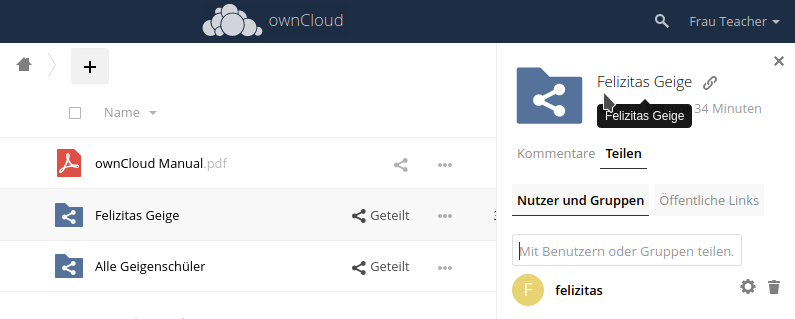
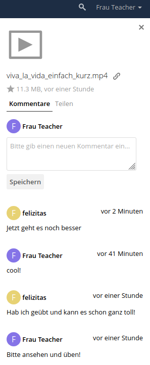

eTraining mit ownCloud
======================

Lange wurde über eLearning diskutiert, aber wenig gemacht. Jetzt brauchen wir dringend eine Lösung. Dieser Blog soll zeigen, was hier mit einer normalen ownCloud Installation zu erreichen ist, ohne dass langes Kennenlernen der Plattform für alle Beteiligten nötig ist.

Es wird eine wirklich einfache Variante gezeigt, mit der aber schon erstaunlich viel möglich ist.

Das besondere ist, dass nicht nur Inhalte zur Verfügung gestellt werden können (das ist, was auf Youtube passiert), sondern dass es zusätzlich einen Weg für Schüler gibt, ihre Ergebnisse zur Ansicht/Korrektur zurückzuliefern. Darüberhinaus gibt es noch eine einfache Dialog-Möglichkeit, um einzelne Dateien zu kommentieren.

Damit besteht eine Feedback Schleife zwischen Schüler und Lehrer, die natürlich nicht an persönlichen Unterricht heranreicht, aber besser als z.B. Mailkommunikation ist.

Dieses System kann nicht nur Lehrern helfen, sondern auch anderen Berufsgruppen wie z.B. Physiotherapeuten, die damit den Patienten per Video etwas zeigen und dann Hinweise auf Basis der zurückgeschickten Dateien geben können.

## ownCloud als eTraining Platform

ownCloud ist eine open source Infrastruktur zum Betreiben von sog. privaten Cloud-Speicher. Mit seinen Möglichkeiten zur Zusammenarbeit bietet es alles, was für die Aufgabenstellung eines einfachen eTrainings notwendig ist.

### Dateien teilen

ownCloud stellt als zentralen Baustein der ganzen Idee das sog. *File Sharing* zur Verfügung. Das bedeutet, dass ein Benutzer in der Cloud einem anderen sehr einfach Zugriff auf seine Dateien geben kann, ohne die zu kopieren oder hin- und herzuschicken.

Dazu legt der Lehrer in seiner ownCloud für jeden seiner Schüler ein Verzeichnis an, in das Dokumente oder Videos für einen Schüler gespeichert werden. Mittels des *File Sharings* kann der Lehrer dieses Verzeichnis nun per Klick mit dem entsprechenden Schüler teilen. Das bedeutet, dass das Verzeichnis des Lehrers im ownCloud-Zugang des Schülers "auftaucht".

Der Schüler hat damit Zugriff auf den Inhalt, den der Lehrer für ihn zur Verfügung gestellt hat. Er kann Dokumente herunterladen und zB. Videos ansehen.

Mit ownClouds Fähigkeit, Benutzer in Gruppen zu organisieren, können Inhalte genauso einfach zB. gleich für eine ganze Klasse zur Verfügung gestellt werden.

### Feedback

Nun ist es aber auch möglich, dass der Schüler eine Datei in den vom Lehrer geteilten Folder zurücklegt. Das geschieht durch Hochladen einer Datei in das Verzeichnis. Das kann z.B. ein bearbeitetes und gescanntes Papier sein oder auch ein kurzes Video.

Der Lehrer kann nun nachvollziehen, was der Schüler mit den Lerninhalten erreicht hat und seinerseits Feedback geben.

### Kommentare

Ein in diesem Zusammenhang nützliches Feature ist die Kommentar-Funktion, die ownCloud auf Datei-Ebene zur Verfügung stellt. Damit können von jedem Benutzer Kommentare zu einer Datei geschrieben werden.

Im Falle der geteilten Inhalte ist dann ein einfacher Dialog um die verschiedenen Dateien leicht möglich.

## Ausblick

ownCloud hat als erfolgreiches open source Projekt noch eine Vielzahl von mehr Möglichkeiten, aber mit diesen wenigen Schritten sollte schon ein rudimentärer eTraining Ablauf möglich sein, der Schüler und Lehrer schnell und relativ unkompliziert wieder zusammenbringt.

Weitere Features wie File-Tags, Gruppenmanagement, Ablaufdaten etc. können im weiteren Verlauf hinzugenommen werden.

